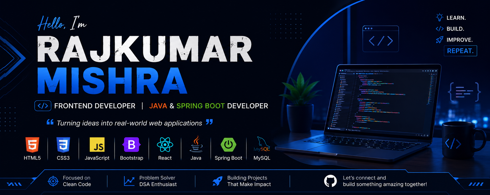

<p align="center">
  
</p>

# 👋 Hi, I'm Rajkumar Mishra

### 💻 Frontend Developer | Java & Spring Boot Developer

<p align="left">
  <a href="https://github.com/mishraraj14">
    
  </a>
</p>

I’m a **B.Sc. Information Technology student** passionate about building modern, responsive, and practical web applications.

I enjoy turning ideas into real-world projects, creating user-friendly interfaces, and continuously improving my development skills through hands-on learning. 🚀

---

## 🚀 About Me

* 🎓 B.Sc. Information Technology Student
* 💻 Interested in **Frontend & Full-Stack Development**
* 🌱 Currently improving **Java, Spring Boot & JavaScript**
* 🎨 Interested in **UI/UX & Responsive Web Design**
* 🧩 Practicing **Data Structures & Algorithms**
* 🚀 Building practical and real-world projects
* 📚 Always learning and experimenting with new technologies

---

## 🛠️ Tech Stack

### 🌐 Frontend

<p>
  
</p>

### ☕ Backend

<p>
  
</p>

### 🗄️ Database

<p>
  
</p>

### 🔧 Tools & Technologies

<p>
  
</p>

---

## 🌟 Featured Projects

### 🌉 HopeBridge Foundation – NGO Connect

A web-based NGO management platform developed using **Java, Spring Boot, Thymeleaf, Bootstrap and MySQL**.

**Key Features:**

* 👤 User Registration & Login
* 🔐 Role-Based Authentication
* 👨‍💼 Admin Dashboard
* 👤 User Dashboard
* 📝 Profile Management
* 📅 Event Management
* 🤝 Volunteer Management
* 💰 Donation Management
* 📩 Contact Management

🔗 **[View Repository](https://github.com/mishraraj14/ngo-connect)**

---

### 🎓 Attendance System

A **Python-based attendance management system** designed to simplify attendance-related operations and management.

🔗 **[View Repository](https://github.com/mishraraj14/ATTENDANCE-SYSTEM)**

---

## 📊 GitHub Statistics

<p align="center">
  
  
</p>

## 🔥 Contribution Streak

<p align="center">
  
</p>

---

## 🎯 2026 Goals

* 🚀 Become a professional **Frontend Developer**
* ⚛️ Improve **React.js** skills
* ☕ Strengthen **Java & Spring Boot**
* 🧠 Improve **Data Structures & Algorithms**
* 💼 Build production-ready applications
* 🎨 Create better UI/UX experiences
* 🌐 Build a strong developer portfolio
* 🤝 Contribute to Open Source projects

---

## 📚 Currently Learning

```text
HTML & CSS
   ↓
JavaScript
   ↓
React.js
   ↓
Java
   ↓
Spring Boot
   ↓
Full-Stack Development
```

---

## 🤝 Let's Connect

<p align="left">
  <a href="mailto:mishraritesh654563@gmail.com">
    
  </a>
  <a href="https://www.linkedin.com/in/rajkumar-mishra-b10076360/">
    
  </a>
  <a href="https://github.com/mishraraj14">
    
  </a>
</p>

---

## 💡 Developer Mindset

> **Learn. Build. Improve. Repeat. 🚀**

⭐ Thanks for visiting my profile!

If you find my projects useful, consider giving them a ⭐.
